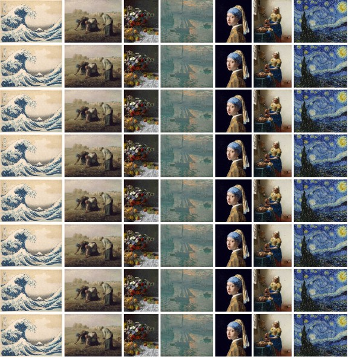

# Image Combiner

## Recommended Environment
This tool is designed for use on a PC with the Google Chrome browser. Operation on other devices or browsers is not guaranteed.

## 推奨環境
このツールは、PC上のGoogle Chromeブラウザでの使用を想定しています。他のデバイスやブラウザでの動作は保証されていません。

## Demo
You can try this tool on the page below.

https://black-sesame-ice-cream.github.io/image-combiner/

## デモ
以下のページでこのツールを試すことができます。

https://black-sesame-ice-cream.github.io/image-combiner/

## Overview
Image Combiner is a web tool that allows you to upload multiple images and automatically combine them into a single, continuous image file. 

The unique feature of this tool is that it **loops the uploaded images** until they fill a specified pixel length. This makes it ideal for creating long image strips, repeating patterns, or simply merging materials with customizable spacing.

**Key Features:**
- **Flexible Arrangement:** Stack images vertically or horizontally.
- **Looping Function:** Automatically repeats images to fill the target size (limit pixels).
- **HEIC Support:** Converts HEIC files (iPhone photos) to PNG directly in the browser.
- **Customization:** Adjustable padding and background colors.
- **Privacy:** All processing is done locally within your browser; images are not uploaded to any server.

## 概要
Image Combinerは、複数の画像をアップロードして、自動的に繋ぎ合わせて1枚の画像として保存できるWebツールです。

このツールの特徴は、**指定した長さを埋めるまで画像を自動でループ配置する**点です。これにより、単なる画像の連結だけでなく、長い画像ストリップや繰り返しパターンの作成が容易に行えます。

**主な特徴:**
- **自由な配置:** 縦方向（Vertical）または横方向（Horizontal）への結合が可能。
- **ループ機能:** 指定した制限サイズ（px）に達するまで、アップロードした画像リストを繰り返し配置します。
- **HEIC対応:** iPhoneなどで撮影されたHEIC形式の画像を、ブラウザ上で自動的にPNGに変換して読み込みます。
- **カスタマイズ:** 画像間の余白（パディング）や背景色を自由に設定可能。
- **プライバシー:** すべての処理はブラウザ内で完結し、サーバーへのアップロードは行われません。

## Usage
1.  **Add Images**
    Drag and drop your image files into the "Add Images" area, or click to select files. Supported formats include JPEG, PNG, WebP, GIF, and HEIC.
2.  **Adjust Settings**
    Configure the canvas settings on the right panel:
    - **Direction:** Choose to stack images Vertically or Horizontally.
    - **Limit Size (px):** Set the maximum length. Images will be repeated to fill this length.
    - **Padding (px):** Set the spacing between images.
    - **Background Color:** Choose a background color for the canvas.
3.  **Preview & Edit**
    The preview updates automatically. You can remove individual images from the "Media Pool" list on the left.
4.  **Save**
    Click the "Save Image (PNG)" button to download the combined result.

## 使い方
1.  **画像を追加**
    「画像を追加」エリアにファイルをドラッグ＆ドロップするか、クリックして選択してください。JPEG, PNG, WebP, GIFに加え、HEIC形式にも対応しています。
2.  **設定を調整**
    右側のパネルでキャンバスの設定を行います：
    - **並べる方向:** 縦（Vertical）か横（Horizontal）かを選択します。
    - **制限サイズ (px):** 作成する画像の最大長を指定します。この長さを埋めるように画像が繰り返されます。
    - **画像余白 (px):** 画像間のスペースを指定します。
    - **背景色:** 背景の色を設定します。
3.  **プレビューと編集**
    プレビューは自動的に更新されます。左側の「メディアプール」リストから個別に画像を削除することも可能です。
4.  **保存**
    「画像を保存 (PNG)」ボタンをクリックして、結合された画像をダウンロードします。

## Licenses
Please see below for details.

[License](LICENSE/)

[Third-Party Licenses](THIRD-PARTY-LICENSES.txt/)

## ライセンス
以下を参照してください。

[ライセンス](LICENSE/)

[第三者ライセンス](THIRD-PARTY-LICENSES.txt/)

## Tech Stack
- HTML5
- Tailwind CSS (via CDN)
- JavaScript (Vanilla)
- [heic2any]